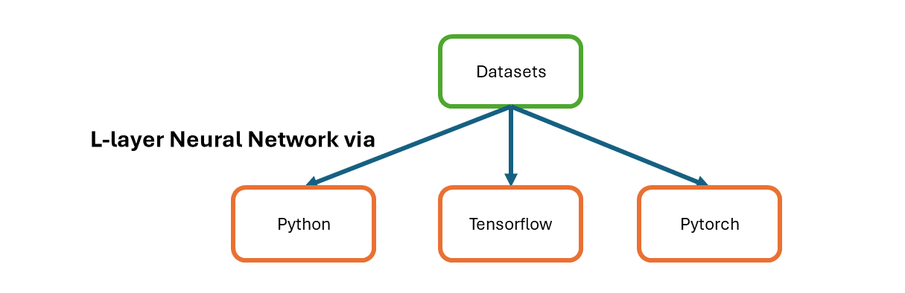
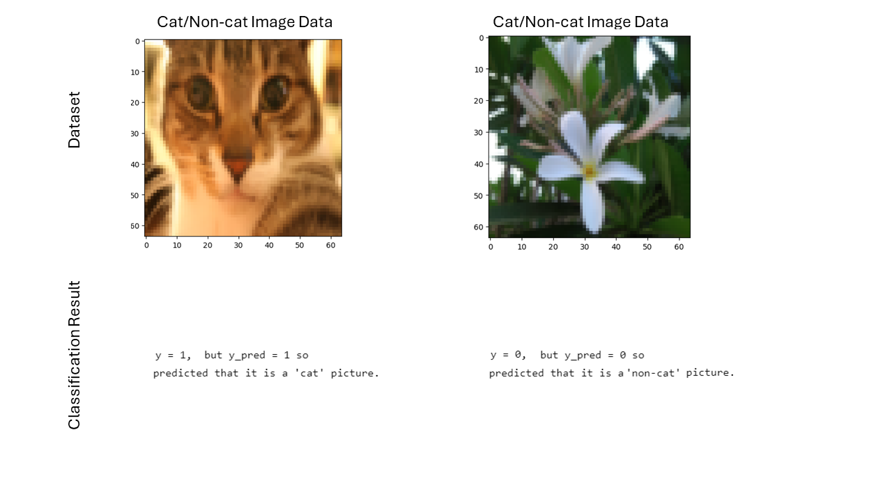
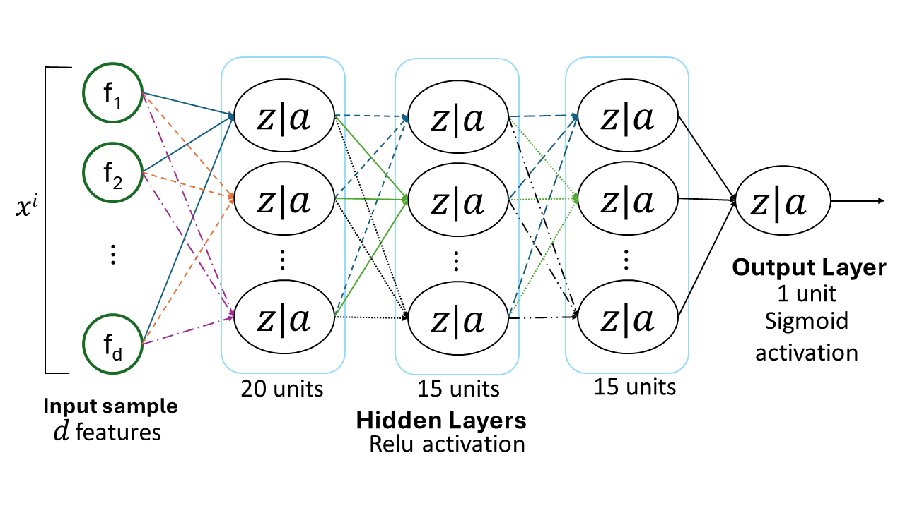

# p005-neural-network-l-layers
Binary classification is done by "L" layer neural network; implemented in vanilla python, tensorflow and pytorch. In tensorflow/pytorch, different APIs are explored to implement dynamic layered algorithm. 
 
Cat/non-cat images are classified with L-layered neural network (input layer not included) where L-1 layers have "relu" activation function and last layer i.e; L layer has "sigmoid" activation function.

## Result/Summary
Binary classification accuracy was increased from 72% in 2 layers(1 hidden layer of 7 neurons) to 80% in 4 layers(3 hidden layers with 20,15,15 neurons) neural network when epochs is kept to 2000.

 
Architecture used is:
 

## Files info
File [cat_nn_classifier.ipynb](cat_nn_classifier.ipynb) contains dynamic layer neural network implemented in plain python. Helper file [helper_functins.py](helper_functions.py) is used by it.
 
File [python_vanilla_code_progression.ipynb](python_vanilla_code_progression.ipynb) contains first two layer neural network functions and then L-layer neural network. It is just for reference to get static and dynamic neural network code in one place.markdown notes for better understanding; and neuron working functions are defined within notebook.
 
File [pytorch2_cat_nn_classifier.ipynb](pytorch2_cat_nn_classifier.ipynb) and [pytorch3_cat_nn_classifier.ipynb](pytorch3_cat_nn_classifier.ipynb) contains l-layer neural network implemented in functional and object-oriented approaches using pytorch, respectively.
 
File [tf2_cat_nn_classifier.ipynb](tf2_cat_nn_classifier.ipynb) and [tf4_cat_nn_classifier.ipynb](tf4_cat_nn_classifier.ipynb) contains l-layer neural network implemented in keras functional and high-level API approaches using tensorflow, respectively.

